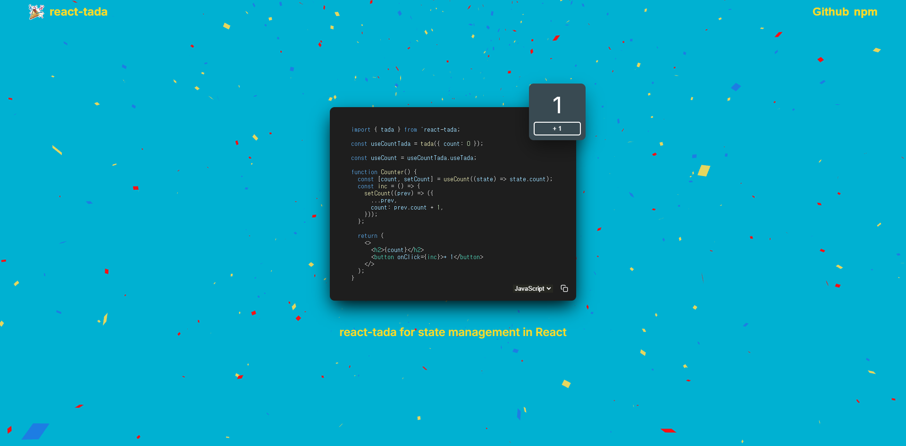

# 🎉react-tada

  

 
 

## react-tada is a library for state management in React.

### visit [website](https://react-tada-website.vercel.app/) or [github](https://github.com/tada-js/react-tada) and [npm](https://www.npmjs.com/package/react-tada)

visit website or github and npm would be appreciated.
Thank you!
